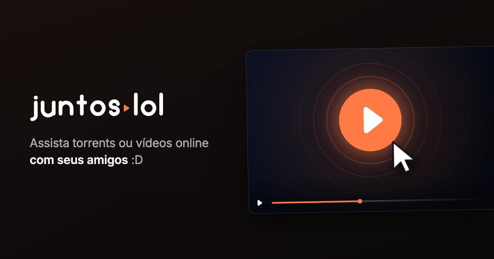
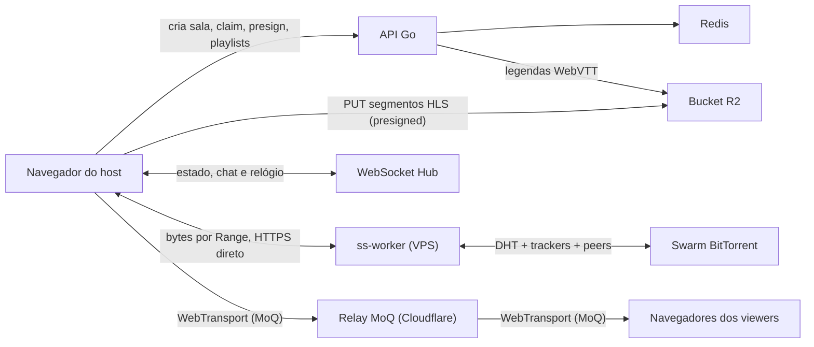

# juntos.lol

[juntos.lol](https://juntos.lol) é uma aplicação de watch party: envie um vídeo ou abra um magnet, compartilhe a sala e assista com outras pessoas usando reprodução sincronizada, chat, múltiplos áudios, legendas e compartilhamento de tela.



## O que está pronto

- o vídeo de um arquivo local ou de uma url é preparado no navegador de quem abre a sala: remux para HLS com [mediabunny](https://mediabunny.dev) e envio dos segmentos direto para o bucket, sem nenhum byte de vídeo e nenhum ffmpeg no servidor;
- início progressivo: a sala começa a tocar com os primeiros segmentos publicados, sem esperar o remux inteiro;
- player responsivo com tela cheia, controles que somem durante a reprodução e suporte a HLS nativo ou `hls.js`;
- sincronização de play, pause, seek e velocidade por WebSocket;
- chat e lista de participantes por sala;
- seleção de faixas de áudio e legendas de texto;
- extração de legendas MKV no navegador, publicadas enquanto o remux continua;
- link do YouTube preparado sem o player do YouTube: o [jlocal](https://github.com/giulianoo0/jlocal) do host ou um ss-worker resolve o vídeo com yt-dlp e remuxa com FFmpeg; áudios dublados viram faixas, legendas manuais e a automática viram WebVTT, capítulos entram na sala e o seek frio abre região nova como num torrent;
- torrent baixado por workers remotos (ss-worker) que o servidor despacha, sem nada para instalar, com os arquivos `.srt` e `.ass` que acompanham o vídeo publicados durante o download;
- tela de espera com a fase da preparação e uma estimativa de quando dá para começar a assistir;
- torrents com seleção de arquivo, sem nenhum download no servidor;
- entrada por link pedindo apenas o apelido, com aviso de quem entra e quem sai da sala;
- compartilhamento de tela ao vivo por MoQ (Media over QUIC) através de um relay da Cloudflare, com o áudio da tela quando o navegador o oferece;
- interface em português e inglês;
- histórico local de salas e metadados Open Graph, Twitter Card e oEmbed;
- catálogo buscável com fontes vindas de plugins que o host instala, num worker sem acesso a rede; a documentação está em [juntos.lol/docs](https://juntos.lol/docs).

## Como funciona



### Preparação do vídeo, no navegador do host

O servidor não processa vídeo. Um arquivo local ou uma url custam CPU na máquina de quem abre a sala; um torrent custa CPU no ss-worker que já o baixa (ver abaixo):

1. O navegador cria a sala com `POST /api/rooms` e reivindica o direito de produzir a mídia dela (`/client-media/claim`).
2. O [mediabunny](https://mediabunny.dev) lê a fonte — arquivo local ou url de um plugin — copia o vídeo (H.264, HEVC, VP9, AV1), transcodifica o áudio para AAC e muxa CMAF/HLS em segmentos de 4 segundos.
3. Cada segmento é enviado por `PUT` direto ao bucket, com uma URL assinada pelo servidor (`/client-media/presign`).
4. A cada poucos segundos o navegador entrega as playlists (`/client-media/publish`). O servidor confirma no bucket que cada objeto nomeado existe antes de publicar, então um viewer nunca recebe uma URL que dá 404.
5. A sala passa para `ready` no primeiro segmento confirmado; o remux continua por trás.

O host também toca do próprio remux, pelo MediaSource, sem esperar o bucket.

Uma fonte que o navegador não consegue preparar — codec que ele não decodifica, container que não lê — não abre sala: a tela diz isso e não há servidor para cair de volta. Um claim sem atividade por `UPLOAD_IDLE_MINUTES` é devolvido pelo sweeper, para uma sala abandonada no meio não ficar travada até o TTL.

### Torrents

O servidor não baixa torrent nenhum, e quem abre a sala não instala nada. Um magnet é despachado pelo servidor a um **ss-worker**: um binário Rust (`ss-worker/`) que roda numa VPS própria, entra no swarm e remuxa o arquivo escolhido ali mesmo, com FFmpeg, publicando os segmentos direto no bucket. O navegador do host só lê os bytes por HTTPS `Range` para extrair legendas; os viewers tocam do bucket e nunca tocam o worker. Não existe remux de torrent no navegador: se a frota recusar o preparo, a sala diz isso e não há fallback.

1. O navegador registra o infohash em `POST /api/torrents` (com uma sessão anônima e uma cota por sessão). O servidor escolhe um worker — de preferência um que já tenha o torrent — e assina o job com Ed25519.
2. O worker resolve os metadados no swarm e devolve a lista de arquivos; o navegador faz poll em `GET /api/torrents/{jobId}` até ela chegar.
3. `POST /api/torrents/{jobId}/select` escolhe o arquivo; o worker reserva o disco e prioriza as peças, e o servidor devolve um `readBase` e um ticket assinado, com validade curta e renovado por `POST /api/torrents/{jobId}/token` enquanto a leitura de legendas durar.
4. O navegador pede o preparo em `POST /api/torrents/{jobId}/remux`; o servidor assina a corrida e o worker roda o FFmpeg sobre os próprios bytes, seguindo a posição da sala para o seek. Progresso e `ready` chegam pela sala, como para qualquer viewer.
5. As legendas embutidas no MKV e os arquivos que acompanham o vídeo são lidos do worker pelo navegador do host (`GET {readBase}/v1/f/{ticket}` com `Range` e `/v1/file/{ticket}/{índice}`) e publicados junto.

Os workers discam o servidor por WSS (`/ws/worker-link`), se registram uma vez com `WORKER_ENROLLMENT_SECRET` e depois provam a própria chave; reportam disco, leases e peers a cada dez segundos. Um worker sem cert válido, cheio ou drenando não recebe job. Certificados vêm do Let's Encrypt por ACME, para o IP da VPS ou um nome, sem DNS obrigatório. Sem worker conectado, o caminho de magnet se declara indisponível (`GET /api/torrents/capacity`) e a página diz isso; não há fallback no servidor nem no navegador.

### YouTube

Um link do YouTube não toca por embed: o navegador não consegue nem resolver nem ler os streams (o `googlevideo` só responde CORS ao próprio youtube.com e amarra cada URL ao IP que a resolveu), então quem prepara é um processo fora da página, com o mesmo pipeline do torrent:

1. O site escolhe o backend: o **jlocal** conectado com as ferramentas baixadas (yt-dlp e FFmpeg, buscados uma vez com hash fixado para o diretório de dados do app) ou, sem ele, a **frota** (`POST /api/youtube`, mesma cota por sessão dos magnets, despachado a um worker que anuncia yt-dlp no heartbeat).
2. O backend resolve o `info.json`, escolhe o vídeo mais alto até 1080p (H.264 antes de VP9 e AV1 na mesma altura), uma faixa de áudio por idioma dublado (AAC copiado quando o YouTube oferece, Opus convertido), as legendas manuais e a automática do idioma original, e os capítulos. URLs do CDN nunca saem do processo que as resolveu.
3. O FFmpeg lê cada stream pela bridge de loopback do crate `ss-remux` (`ss-worker/ss-remux/`, compartilhado com o jlocal), que busca o `googlevideo` em pedaços de 10 MiB pelo parâmetro `range=` da própria URL e guarda as bordas do arquivo em memória para os seeks; cada faixa de áudio é um `-i` separado. Legendas são publicadas inteiras em `/subtitles/fleet` antes do primeiro segmento.
4. Seek fora do produzido: para a frota, o servidor segue a posição da sala como no torrent; para o jlocal, o próprio navegador do host orquestra (`POST /youtube/run` com a região seguinte, depois de mover a cerca em `POST /rooms/:id/client-media/run`).

Na VPS o worker sai por um proxy (`YOUTUBE_PROXY`, o mesmo tipo do `PLUGIN_FETCH_PROXY`): o CDN recusa endereços de datacenter como robô. Playlists e vídeos acima de 1080p ficam de fora.

#### Lives

Uma live não é preparada no bucket: não há timeline, seek nem pausa sincronizada, e todo mundo assiste ao vivo pelo mesmo relay MoQ do compartilhamento de tela. O produtor é o **jlocal** quando está conectado com as ferramentas, senão um worker da **frota** (`POST /api/rooms/:id/live` com `producer`); os dois rodam o módulo `live` do crate `ss-remux`:

1. `yt-dlp -J` confirma que a live está no ar e escolhe a variante H.264 mais alta até 1080p e a playlist de áudio mais rica.
2. `ffmpeg -i vídeo.m3u8 -i áudio.m3u8 -c copy -f mpegts -` lê o HLS ao vivo (pelo proxy, na frota) e entrega um único TS, sem re-encode.
3. O TS entra no importador `moq-mux` e sai pelo `moq-native` para o relay, em `juntos/{sala}/{segredo}/live.hang`, no mesmo container e catálogo que o `@moq/watch` do site já lê.

A sala fica `sourceKind: "live"` e o status segue o produtor: `ready` quando o stream está no relay (heartbeat do worker, ou `POST /api/rooms/:id/live/state` vindo do host no caso do jlocal), `error` com `live_ended` quando a live acaba. O espectador vê a live num canvas com o botão "Ir para o vivo", que reassina e cai no grupo mais novo do relay. Cada worker aceita `SS_WORKER_LIVE_SLOTS` lives ao mesmo tempo (padrão 2).

### Sincronização e controle

O primeiro membro criado com a sala é o controlador da reprodução. Somente ele publica play, pause, seek e alteração de velocidade; os demais clientes aplicam o estado recebido e corrigem drift com base no relógio do servidor. Não existe fluxo de “tomar o controle”.

Quem abre o link da sala só precisa informar o apelido; o link já é o convite e nenhum código adicional é pedido. Deixar o campo vazio gera um nome de convidado. Entradas e saídas aparecem como um aviso temporário e como uma linha no chat, comparando a lista de participantes que o servidor transmite.

O apelido é enviado no primeiro frame WebSocket e não aparece na URL. Capacidades sensíveis, como a que autoriza o pedido de acesso ao relay de tela, são aleatórias, mantidas em memória e não são persistidas em query strings ou `localStorage`.

### Áudio e legendas

- Texto: ASS/SSA, SubRip, WebVTT e `mov_text` são convertidos para WebVTT.
- MKV: o navegador extrai as legendas de texto numa passagem sequencial sobre a fonte, em paralelo ao remux (ou ao preparo do worker, no caso de torrent).
- Torrent: os arquivos `.srt`, `.ass`, `.ssa` e `.vtt` que acompanham o vídeo são lidos do worker, convertidos para WebVTT no navegador e publicados quase imediatamente, sem esperar o vídeo. O idioma vem do nome do arquivo.
- O servidor só recebe WebVTT pronto (`POST /api/rooms/:id/subtitles`) e o repassa ao bucket.
- Imagem: PGS e VobSub são detectadas, mas não são exibidas; a interface informa quantas foram ignoradas.

## Executar com Docker

### Requisitos

- Docker Engine com Docker Compose v2;
- portas UDP acessíveis se o compartilhamento de tela for usado fora da máquina local;
- um navegador moderno.

Clone e inicie:

```bash
git clone git@github.com:giulianoo0/ss.git
cd ss
docker compose up --build
```

Acesse [http://localhost:8099](http://localhost:8099). O Compose inicia:

- `app`: frontend compilado, API Go e WebSocket;
- `redis`: salas, participantes e estado sincronizado.

Para encerrar:

```bash
docker compose down
```

O volume `ss-data` guarda só as legendas antes de subirem ao bucket; vídeo e segmentos nunca passam pelo servidor.

## Desenvolvimento local

### Backend

O backend requer Go 1.26 e Redis. Não há ffmpeg.

```bash
go test ./...
go run ./cmd/server
```

Por padrão, o servidor escuta em `:8080`, usa `redis://localhost:6379`, grava em `/data` e procura o frontend compilado em `web/dist`.

### Frontend

```bash
cd web
npm ci
npm run dev
```

Validação completa do frontend:

```bash
npm test
npm run lint
npm run build
```

O Vite serve apenas o frontend durante o desenvolvimento. Para exercitar upload, WebSocket, mídia e torrents, execute também o backend e configure um proxy local ou use a build integrada do Docker.

## Configuração

| Variável | Padrão | Uso |
| --- | --- | --- |
| `PORT` | `8080` | Porta HTTP interna da aplicação. |
| `APP_BIND` | `127.0.0.1:8099` | Bind publicado pelo Docker Compose. |
| `DATA_DIR` | `/data` | Diretório de trabalho das legendas. |
| `WEB_DIR` | `web/dist` | Diretório dos arquivos estáticos compilados. |
| `REDIS_URL` | `redis://localhost:6379` | Conexão Redis. |
| `MAX_UPLOAD_MB` | `51200` | Orçamento de bytes que um remux pode publicar, em MiB. |
| `ROOM_TTL_HOURS` | `5` | Vida útil da sala e da mídia. |
| `MAX_PARTICIPANTS` | `20` | Máximo de conexões simultâneas por sala. |
| `ROOM_IDLE_SECONDS` | `90` | Tempo sem participantes até a sala ser recolhida: registro no Redis, diretório em disco e mídia no bucket. |
| `UPLOAD_IDLE_MINUTES` | `10` | Tempo sem atividade até o claim de um remux ser devolvido. |
| `MOQ_RELAY_URL` | vazio | Relay MoQ da Cloudflare, por exemplo `https://draft-16.cloudflare.mediaoverquic.com`. Sem ele o compartilhamento de tela fica desligado. |
| `MOQ_PUBLISH_TOKEN` | vazio | Token do relay com `publish` e `subscribe`, entregue só ao controlador da sala. |
| `MOQ_SUBSCRIBE_TOKEN` | vazio | Token do relay só com `subscribe`, entregue aos demais participantes. |

Valores inválidos em variáveis numéricas impedem a inicialização, em vez de cair silenciosamente para outro valor.

`WORKER_LIVE_SLOTS` (padrão 2) vira `SS_WORKER_LIVE_SLOTS`, o número de lives do YouTube que um worker mantém no relay ao mesmo tempo. `YOUTUBE_PROXY` e `YOUTUBE_COOKIES` (opcionais) chegam ao worker como `SS_WORKER_YOUTUBE_PROXY` e `SS_WORKER_YOUTUBE_COOKIES`: o proxy `http`/`socks5` por onde o yt-dlp e a leitura do `googlevideo` saem (obrigatório numa VPS, que o YouTube bloqueia como robô) e um arquivo de cookies no formato Netscape para vídeos que exigem login.

`PLUGIN_FETCH_PROXY` (opcional) é um proxy `http`, `https` ou `socks5` por onde saem as requisições que o servidor faz em nome dos plugins (`GET /api/plugins/fetch`). Serve para quando um addon recusa o endereço da própria instância — o Torrentio bloqueia faixas de datacenter — e a saída precisa vir de outro lugar. A resolução de nomes passa a acontecer no proxy, então a guarda contra endereços privados vale para a rede dele; a política de URL (só `https`, só nomes, nunca o próprio servidor, em cada redirect) continua aqui.

## Produção

O container `app` publica apenas em loopback por padrão. Coloque um proxy TLS, como Caddy ou nginx, na frente de `127.0.0.1:8099`. Para compartilhamento de tela, crie um relay MoQ na conta Cloudflare (Media › Realtime › MoQ Relay, ou `POST /accounts/{id}/moq/relays`) e coloque a URL do relay e o par de tokens padrão nas variáveis `MOQ_*`. O relay faz o fan-out para os viewers; a VPS não carrega mídia nem expõe porta nova. Um relay aceita no máximo 10 tokens, por isso os tokens são por instalação e não por sala: o que isola uma sala da outra é o segredo no caminho do broadcast.

Exemplo mínimo de variáveis:

```dotenv
APP_BIND=127.0.0.1:8099
MOQ_RELAY_URL=https://draft-16.cloudflare.mediaoverquic.com
MOQ_PUBLISH_TOKEN=eyJ...
MOQ_SUBSCRIBE_TOKEN=eyJ...
```

Segredos e ajustes locais de deploy ficam num override do Compose mantido fora do repositório.

Atualização manual da aplicação. O diretório no servidor **não é um clone git** — é uma cópia publicada via `rsync`, então `git pull` lá não existe. Os excludes protegem os dois arquivos que só existem no servidor (`.env` e `docker-compose.override.yml`); sem eles o `--delete` os apagaria e a stack subiria sem credenciais:

```bash
rsync -az --delete \
  --exclude .git/ --exclude web/node_modules/ --exclude web/dist/ --exclude data/ \
  --exclude .env --exclude docker-compose.override.yml \
  ./ usuario@servidor:/opt/ss/
ssh usuario@servidor 'cd /opt/ss \
  && docker compose build app \
  && docker compose up -d app \
  && docker compose ps'
```

## API HTTP

Estas rotas atendem o cliente web e ainda não têm garantia de estabilidade como API pública.

| Método | Rota | Função |
| --- | --- | --- |
| `GET` | `/healthz` | Saúde do processo da aplicação. |
| `POST` | `/api/rooms` | Cria uma sala. |
| `GET` | `/api/rooms/:id` | Consulta status, faixas e expiração. |
| `GET` | `/ws/rooms/:id` | WebSocket de presença, chat e reprodução. |
| `GET` | `/media/:id/hls/*` | Playlists e segmentos HLS. |
| `GET` | `/media/:id/subs/*` | Legendas WebVTT. |
| `POST` | `/api/rooms/:id/subtitles` | Recebe legendas extraídas pelo navegador. |
| `POST` | `/api/rooms/:id/screenshare/token` | Entrega a URL do relay MoQ com o token do papel do membro e o caminho do broadcast da sala. |
| `POST` | `/api/rooms/:id/screenshare/live` | O controlador avisa que começou ou parou de publicar a tela. |
| `GET` | `/api/plugins/fetch?url=` | Faz, em nome de um plugin, a requisição que o navegador não consegue fazer sem carimbar a própria origem. Só `https`, só nomes que resolvem para endereço público, corpo limitado, com sessão e cota por hora. |

## Persistência e segurança

- Salas e estado ficam no Redis com expiração.
- A mídia de cada sala fica no bucket em `rooms/<id>/g<geração>/` e é removida pelo sweeper após o TTL.
- O ID da sala funciona como link de acesso; não há contas ou ACL por usuário.
- Nomes de arquivo, apelidos, IDs, caminhos de mídia, legendas e ranges são validados e limitados.
- Rotas de API usam `Cache-Control: no-store`, `Referrer-Policy: no-referrer`, `X-Content-Type-Options: nosniff` e bloqueio de framing.
- O Gin não confia em cabeçalhos de proxy enviados pelo cliente.
- O acesso ao relay MoQ só é entregue a membros que apresentem a capacidade efêmera recebida pelo WebSocket; o token de publicação vai só ao controlador.

## Limitações conhecidas

- Torrents exigem ao menos um ss-worker conectado ao servidor, e a disponibilidade depende do swarm. Metadados disponíveis não garantem que todas as peças do vídeo tenham seed.
- PGS e VobSub são legendas bitmap e não são renderizadas pelo player atual.
- O link da sala concede acesso a quem o possui.
- Só navegadores capazes de remuxar (WebCodecs para decodificar o áudio, AAC para codificar) abrem sala com vídeo. Quem assiste não precisa de nada disso.

## Estrutura do repositório

```text
cmd/server/          entrada do servidor Go
internal/config/     configuração por ambiente
internal/httpapi/    rotas HTTP, mídia, legendas e relay de tela
internal/media/      o lado servidor do pipeline do cliente: validação e render de playlists, publicação de legendas
internal/objectstore/ bucket R2
internal/room/       modelo, Redis e expiração
internal/sync/       WebSocket, presença, chat e relógio
web/src/             aplicação React/TypeScript
```

## Contribuindo

Antes de abrir um pull request:

```bash
go test ./...
cd web
npm test
npm run lint
npm run build
```

Inclua testes para mudanças de comportamento e não versione arquivos de mídia, caches, `.env` ou segredos.
